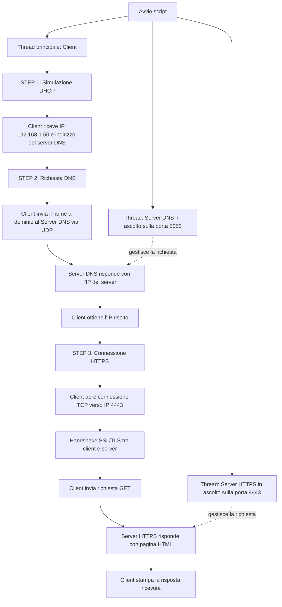

# Flowchart

```mermaid
flowchart TD
    A[Avvio script] --> B[Thread: Server DNS in ascolto sulla porta 5053]
    A --> C[Thread: Server HTTPS in ascolto sulla porta 4443]
    A --> D[Thread principale: Client]

    D --> E[STEP 1: Simulazione DHCP]
    E --> F[Client riceve IP 192.168.1.50 e indirizzo del server DNS]

    F --> G[STEP 2: Richiesta DNS]
    G --> H[Client invia il nome a dominio al Server DNS via UDP]
    H --> I[Server DNS risponde con l'IP del server]
    I --> J[Client ottiene l'IP risolto]

    J --> K[STEP 3: Connessione HTTPS]
    K --> L[Client apre connessione TCP verso IP:4443]
    L --> M[Handshake SSL/TLS tra client e server]
    M --> N[Client invia richiesta GET]
    N --> O[Server HTTPS risponde con pagina HTML]
    O --> P[Client stampa la risposta ricevuta]

    C -.gestisce la richiesta.-> O
    B -.gestisce la richiesta.-> I
```
